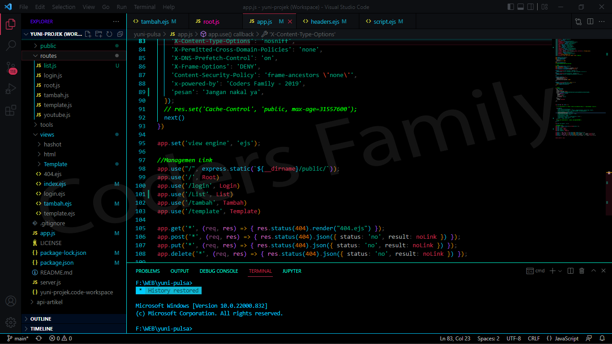

# cr4r.black
tema visual studio code

## Cara pakai
### Windows
- Buka Windows Explorer
- copas ini alamat <b>"C:\Users\\%username%\\.vscode\extensions\"</b>
- Letakkan folder projek disana
- Buka Visual Studio Code
- Menuju ke Tab <b>Extensions</b> atau tekan <b>CTRL+SHIFT+X</b>
- Cari "<b>Tema CodersFamily</b>"
- Tekan tombol <b>Set Color Theme</b>
- Agar lebih optimal tutup Visual Studio Code, lalu buka kembali

### Linux ?
- Cari sendiri hehe

## Terima kasih
- Tema yang terinspirasi dari [`BeardedBear`](https://github.com/BeardedBear/bearded-theme)

## Screenshot

